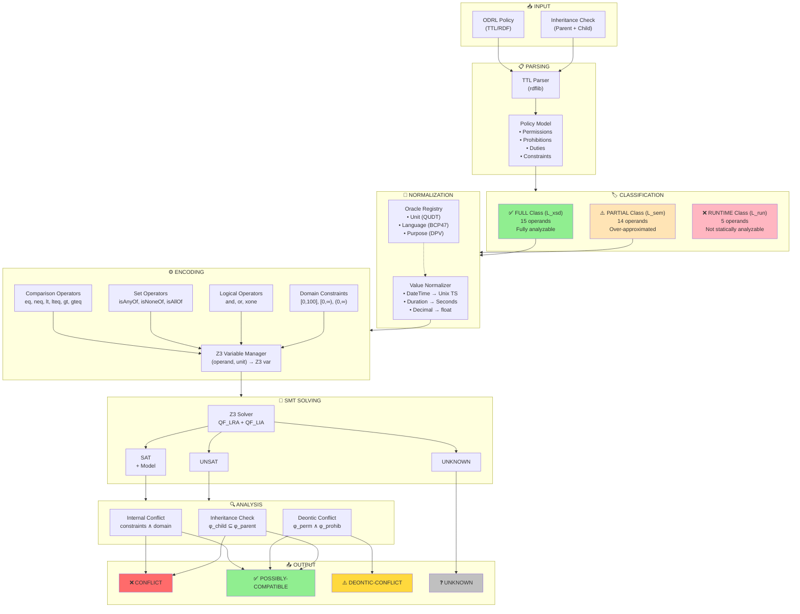
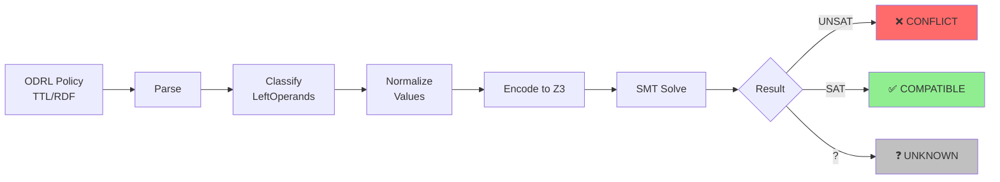
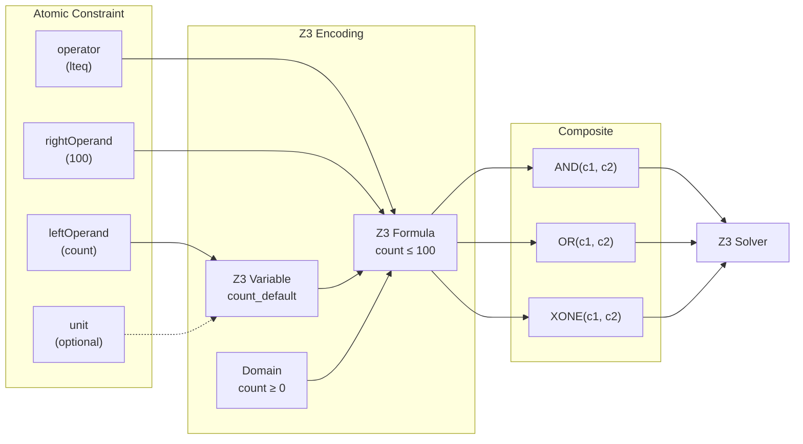
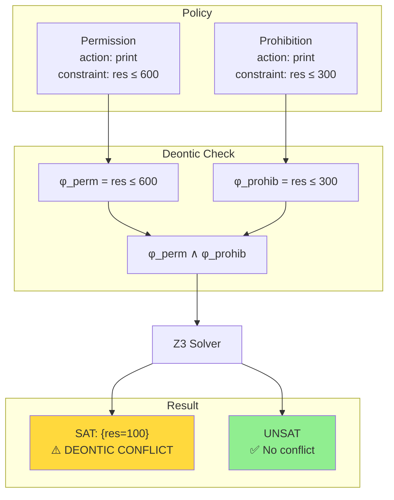
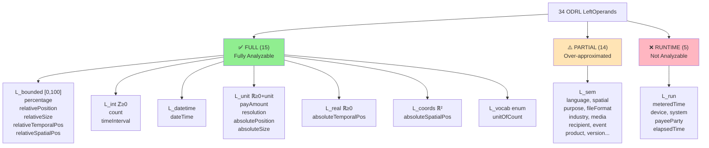

```mermaid
flowchart TB
    subgraph INPUT["📥 INPUT"]
        TTL["ODRL Policy<br/>(TTL/RDF)"]
        INH["Inheritance Check<br/>(Parent + Child)"]
    end

    subgraph PARSE["📋 PARSING"]
        PARSER["TTL Parser<br/>(rdflib)"]
        MODEL["Policy Model<br/>• Permissions<br/>• Prohibitions<br/>• Duties<br/>• Constraints"]
    end

    subgraph CLASSIFY["🏷️ CLASSIFICATION"]
        direction TB
        FULL["✅ FULL Class (L_xsd)<br/>15 operands<br/>Fully analyzable"]
        PARTIAL["⚠️ PARTIAL Class (L_sem)<br/>14 operands<br/>Over-approximated"]
        RUNTIME["❌ RUNTIME Class (L_run)<br/>5 operands<br/>Not statically analyzable"]
    end

    subgraph NORMALIZE["🔄 NORMALIZATION"]
        NORM["Value Normalizer<br/>• DateTime → Unix TS<br/>• Duration → Seconds<br/>• Decimal → float"]
        ORACLE["Oracle Registry<br/>• Unit (QUDT)<br/>• Language (BCP47)<br/>• Purpose (DPV)"]
    end

    subgraph ENCODE["⚙️ ENCODING"]
        VAR["Z3 Variable Manager<br/>(operand, unit) → Z3 var"]
        CMP["Comparison Operators<br/>eq, neq, lt, lteq, gt, gteq"]
        SET["Set Operators<br/>isAnyOf, isNoneOf, isAllOf"]
        LOG["Logical Operators<br/>and, or, xone"]
        DOM["Domain Constraints<br/>[0,100], [0,∞), (0,∞)"]
    end

    subgraph SMT["🧮 SMT SOLVING"]
        Z3["Z3 Solver<br/>QF_LRA + QF_LIA"]
        SAT["SAT<br/>+ Model"]
        UNSAT["UNSAT"]
        UNK["UNKNOWN"]
    end

    subgraph ANALYSIS["🔍 ANALYSIS"]
        INT["Internal Conflict<br/>constraints ∧ domain"]
        DEO["Deontic Conflict<br/>φ_perm ∧ φ_prohib"]
        INHER["Inheritance Check<br/>φ_child ⊆ φ_parent"]
    end

    subgraph OUTPUT["📤 OUTPUT"]
        CONFLICT["❌ CONFLICT"]
        COMPAT["✅ POSSIBLY-COMPATIBLE"]
        DEONTIC["⚠️ DEONTIC-CONFLICT"]
        UNKNOWN["❓ UNKNOWN"]
    end

    TTL --> PARSER
    INH --> PARSER
    PARSER --> MODEL
    MODEL --> CLASSIFY
    
    FULL --> NORMALIZE
    PARTIAL --> NORMALIZE
    
    NORM --> ENCODE
    ORACLE -.-> NORM
    
    VAR --> SMT
    CMP --> VAR
    SET --> VAR
    LOG --> VAR
    DOM --> VAR
    
    Z3 --> SAT
    Z3 --> UNSAT
    Z3 --> UNK
    
    SAT --> ANALYSIS
    UNSAT --> ANALYSIS
    
    INT --> CONFLICT
    INT --> COMPAT
    DEO --> DEONTIC
    DEO --> COMPAT
    INHER --> CONFLICT
    INHER --> COMPAT
    UNK --> UNKNOWN

    style FULL fill:#90EE90
    style PARTIAL fill:#FFE4B5
    style RUNTIME fill:#FFB6C1
    style CONFLICT fill:#FF6B6B
    style COMPAT fill:#90EE90
    style DEONTIC fill:#FFD93D
    style UNKNOWN fill:#C0C0C0
```

---

## Simplified Pipeline Diagram

```mermaid
graph LR
    A[ODRL Policy<br/>TTL/RDF] --> B[Parse]
    B --> C[Classify<br/>LeftOperands]
    C --> D[Normalize<br/>Values]
    D --> E[Encode to Z3]
    E --> F[SMT Solve]
    F --> G{Result}
    G -->|UNSAT| H[❌ CONFLICT]
    G -->|SAT| I[✅ COMPATIBLE]
    G -->|?| J[❓ UNKNOWN]

    style H fill:#FF6B6B
    style I fill:#90EE90
    style J fill:#C0C0C0
```

---

## Constraint Encoding Flow

```mermaid
flowchart LR
    subgraph ATOMIC["Atomic Constraint"]
        LO["leftOperand<br/>(count)"]
        OP["operator<br/>(lteq)"]
        RO["rightOperand<br/>(100)"]
        UN["unit<br/>(optional)"]
    end

    subgraph ENCODE["Z3 Encoding"]
        VAR["Z3 Variable<br/>count_default"]
        FORM["Z3 Formula<br/>count ≤ 100"]
        DOMAIN["Domain<br/>count ≥ 0"]
    end

    subgraph COMPOSITE["Composite"]
        AND["AND(c1, c2)"]
        OR["OR(c1, c2)"]
        XONE["XONE(c1, c2)"]
    end

    LO --> VAR
    OP --> FORM
    RO --> FORM
    UN -.-> VAR
    
    VAR --> FORM
    DOMAIN --> FORM
    
    FORM --> AND
    FORM --> OR
    FORM --> XONE

    AND --> Z3["Z3 Solver"]
    OR --> Z3
    XONE --> Z3
```

---

## Deontic Conflict Detection

```mermaid
flowchart TB
    subgraph POLICY["Policy"]
        PERM["Permission<br/>action: print<br/>constraint: res ≤ 600"]
        PROH["Prohibition<br/>action: print<br/>constraint: res ≤ 300"]
    end

    subgraph CHECK["Deontic Check"]
        PHI_P["φ_perm = res ≤ 600"]
        PHI_R["φ_prohib = res ≤ 300"]
        CONJ["φ_perm ∧ φ_prohib"]
    end

    subgraph RESULT["Result"]
        SAT["SAT: {res=100}<br/>⚠️ DEONTIC CONFLICT"]
        UNSAT["UNSAT<br/>✅ No conflict"]
    end

    PERM --> PHI_P
    PROH --> PHI_R
    PHI_P --> CONJ
    PHI_R --> CONJ
    CONJ --> Z3["Z3 Solver"]
    Z3 --> SAT
    Z3 --> UNSAT

    style SAT fill:#FFD93D
    style UNSAT fill:#90EE90
```

---

## LeftOperand Classification Hierarchy

```mermaid
graph TB
    ROOT["34 ODRL LeftOperands"]
    
    ROOT --> FULL["✅ FULL (15)<br/>Fully Analyzable"]
    ROOT --> PARTIAL["⚠️ PARTIAL (14)<br/>Over-approximated"]
    ROOT --> RUNTIME["❌ RUNTIME (5)<br/>Not Analyzable"]
    
    FULL --> BOUNDED["L_bounded [0,100]<br/>percentage<br/>relativePosition<br/>relativeSize<br/>relativeTemporalPos<br/>relativeSpatialPos"]
    FULL --> INT["L_int ℤ≥0<br/>count<br/>timeInterval"]
    FULL --> DT["L_datetime<br/>dateTime"]
    FULL --> UNIT["L_unit ℝ≥0+unit<br/>payAmount<br/>resolution<br/>absolutePosition<br/>absoluteSize"]
    FULL --> REAL["L_real ℝ≥0<br/>absoluteTemporalPos"]
    FULL --> COORD["L_coords ℝ²<br/>absoluteSpatialPos"]
    FULL --> VOCAB["L_vocab enum<br/>unitOfCount"]
    
    PARTIAL --> SEM["L_sem<br/>language, spatial<br/>purpose, fileFormat<br/>industry, media<br/>recipient, event<br/>product, version..."]
    
    RUNTIME --> RUN["L_run<br/>meteredTime<br/>device, system<br/>payeeParty<br/>elapsedTime"]

    style FULL fill:#90EE90
    style PARTIAL fill:#FFE4B5
    style RUNTIME fill:#FFB6C1
```
